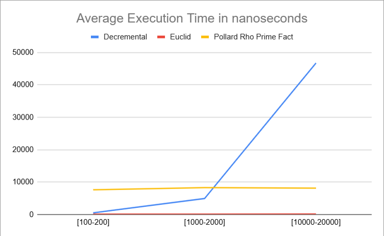
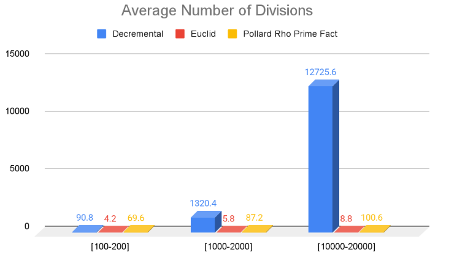

# Paper 1

### Note:
We discussed three algorithms to compute the GCD of two non-negative integers m, n in chapter 1. The algorithms were (1) Euclid’s algorithm, (2) Starting with n as the candidate for gcd and if it does not divide both numbers then reduce the candidate gcd by 1 in each iteration and (3) prime factorization and taking the common factors. This paper will explore the experimental results of running the three algorithms.  

Pollard's rho method is used for factorization. 
Instead of trial division, the Pollard Rho algorithm is a faster way to find factors of a number that are not the number itself or one. It is based on modular arithmetic randomness and when drawn,  shape pattern is formed. Random numbers are generated in a loop. The numbers eventually repeat because of mod n.  

### Files:
**Paper_1.cpp**     - This is where all the functions live  
**Paper_1.h**       - H file for Paper_1.cpp  
**Paper_1Test.cpp** - Test file. This is the file to run test and create data.  
                - It runs three tests. Test 1 runs a testing range of (100-200), Test 2 runs a testing range of (1000-2000), Test 3 runs a testing range of  
                  (10000-20000). It'll pick a random m for each test and n is always smaller than m.  
**results.csv**     - Results from Paper_1Test.cpp is written here. There is data already in here so feel free to check it out.  
**avg_execution_time.png** - A screenshot of a graph for average execution time in nanoseconds during test.  
**avg_num_divisions.png**  - A screenshot of a graph for average number of divisions executed during the test.  

### How To Run: 
g++ Paper_1Test.cpp Paper_1.cpp -o test  
./test  

### Results:
  

